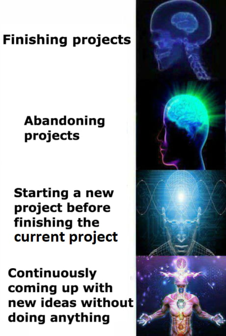

# Why do I blog?

### TL;DR: I'm at the age where I can't trust my brain to store all my stupid ideas without jotting them down somewhere.

There are times when thoughts follow one another so persistently that I just cannot sleep. I once thought they were just random, useless musings stemming from anxiety because it often happens when I have a lot to do to meet a tight deadline (perhaps stress would be a better word than anxiety). But I've realized that I was actually organizing what I need to do.

> Gosh, I need to finish this project by next week. I think issue A is the biggest problem. What can I do? Maybe I can try solution A... oh wait, why not solution B? Ah right, solution B wasn't an option because of reasons A, B, and C. Is solution A the most efficient approach? What will I do if it doesn’t work? ...

I recently realized that this is my way of "thinking". I often go through this "chain of thoughts" process with different topics, and they shape my daily life. If I were to list a few successful (?) ones:

- I don't want to work just for money. -> I need a passive income. -> I don't want to do something just to make money. -> What could I be proud of that also provides a little boost to my income? -> Maybe a book would be a good option?
  - By the way, this idea of passive income failed. Money has never been my primary driving factor anyway.
- I see the importance of working out regularly. -> But it's boring, and it's something I'd easily skip if I'm too busy. -> I like music, so let's take some dance classes.
  - No, I still don’t dance well.

I also find that I need to revisit some of these "chains" once in a while. But my brain is already 30+ years old, and I know it often suffers from "catastrophic forgetting".

Therefore, I have decided to record them. This blog is mostly for myself, but I am putting in some extra effort to make it public, mostly to push myself to clearly describe what I am thinking.

If you happen to come across my blog, I hope you enjoy following my chains of thoughts. However, please be mindful of the following points:

1. I may remove an article at any time if I decide to keep it private.
2. It may contain sensitive topics. Please do not judge even if my point of view is different from yours.
3. Not everything in these blogs will be scientifically verified.
4. The date the blog is uploaded has nothing to do with when I came up with the thought. I will likely start each chain from the beginning, and it may take some time to share up-to-date thoughts.
5. Though I try my best (and really want to be), I am not a great writer. Please be mindful of my limited writing skills.
